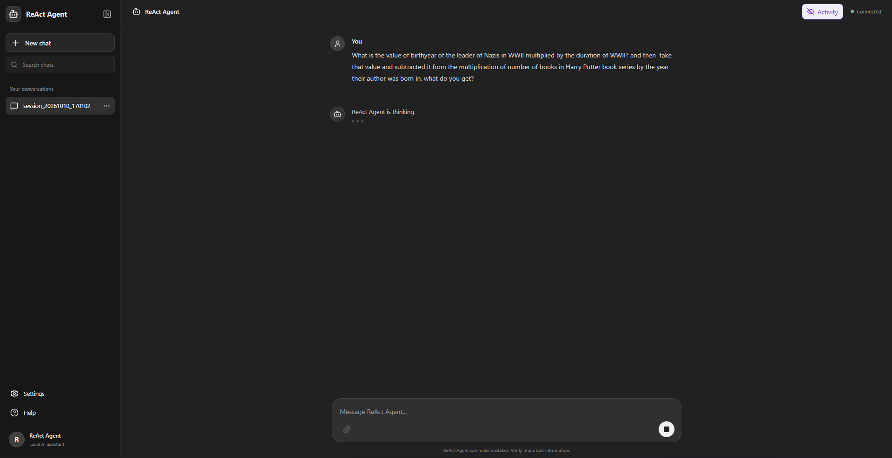
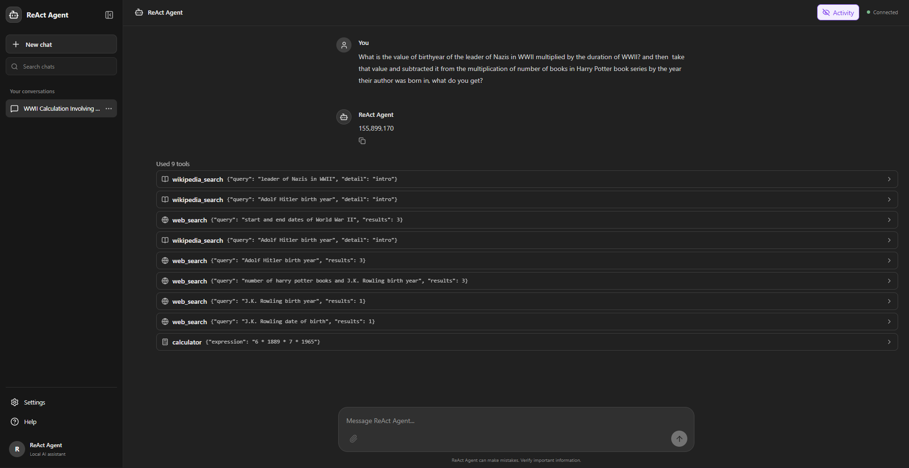
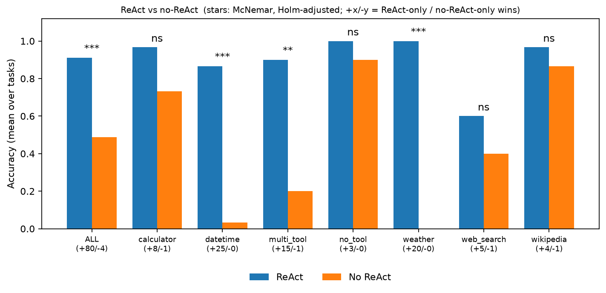

# 🤖 ReAct-Agent

A local ReAct (Reasoning and Acting) agent powered by Ollama. It uses a language model to select tools, process their observations, and generate answers. The project includes a FastAPI backend and a React frontend with streaming responses and persistent conversations.

[](https://gitdiagram.com/amirmasoudcs/react-agent?utm_source=readme&utm_medium=picture)

## ✨ Features

The agent supports tool-assisted reasoning with a calculator, date and time utility, weather lookup, Wikipedia search, and web search. Conversations can be created, resumed, renamed, and deleted, while context management summarizes older history to help fit within the model's context window.

The web interface provides streaming responses, visible tool activity, and configurable model settings. The agent can also run through a command-line interface.

A built-in [benchmark](#-benchmark-and-evaluation) compares the agent with the same model running without tools, using automatic and human grading and paired statistical tests.

## 🖥️ Screenshots

<div align="center">
  <div>
    
    <p><strong>Thinking and tool execution</strong><br />
    The agent receives a question and displays its in-progress
    state while it works toward an answer.</p>
  </div>
  <div>
    
    <p><strong>Final answer and activity log</strong><br />
    The completed response is shown alongside the tools the
    agent used, making its actions easy to inspect.</p>
  </div>
</div>

## 🛠️ Tech Stack

**Backend:** Python, FastAPI, Ollama, OpenAI Python SDK

**Frontend:** React, Vite, JavaScript

## 🚀 Installation and Getting Started

### 📋 Prerequisites

Before starting, make sure you have [Python](https://www.python.org/downloads/), [Node.js and npm](https://nodejs.org/en/download), and [Ollama](https://ollama.com/download) installed.

### 1. 🧠 Set Up Ollama

Download the model used by default:

```bash
ollama pull gemma4:e4b
```

Make sure Ollama is running before starting the agent.

### 2. 🐍 Set Up the Backend

Clone the repository and navigate to its root directory. Create and activate a virtual environment.

**Windows (PowerShell)**

```powershell
python -m venv .venv
.\.venv\Scripts\Activate.ps1
```

**Windows (Command Prompt)**

```bat
python -m venv .venv
.venv\Scripts\activate.bat
```

**macOS and Linux**

```bash
python3 -m venv .venv
source .venv/bin/activate
```

Install the Python dependencies:

```bash
python -m pip install -r requirements.txt
```

Create a `.env` file in the project root with the following configuration:

```dotenv
OLLAMA_BASE_URL=http://localhost:11434/v1
OLLAMA_MODEL=gemma4:e4b
OLLAMA_API_KEY=ollama
DEBUG=1
OLLAMA_DEBUG=1
```

Start the backend API:

```bash
python -m uvicorn api:app --reload
```

The API will be available at `http://127.0.0.1:8000`.

### 3. ⚛️ Set Up the Frontend

Open a **second terminal** and navigate to the frontend directory:

```bash
cd frontend
npm install
```

Create a `.env` file inside the `frontend` directory:

```dotenv
VITE_API_BASE_URL=http://127.0.0.1:8000/api
VITE_APP_NAME=ReAct Agent
```

Start the frontend development server:

```bash
npm run dev
```

Open the local URL printed in your terminal, usually `http://localhost:5173`.

Keep both the backend and frontend terminals running while using the application.

## 💻 CLI Usage

The agent can be used directly from the terminal. Run all commands from the project root with the virtual environment activated.

```bash
python -m main <command> [streaming_option]
```

### Available Commands

| Command                                         | Description                                                                                               |
| ----------------------------------------------- | --------------------------------------------------------------------------------------------------------- |
| `-n`, `--new`                                   | Create a new conversation session and start chatting.                                                     |
| `-l`, `--list`                                  | List saved sessions and interactively select one to resume.                                               |
| `-sn`, `--session-name NAME`                    | Resume a session by its name or ID.                                                                       |
| `-rs`, `--rename-session CURRENT_NAME NEW_NAME` | Rename a saved session without opening it.                                                                |
| `-rm`, `--remove [SESSION]`                     | Remove a saved session by name or ID, or select one interactively. Requires confirmation before deletion. |
| `--help`                                        | Display the available arguments and their descriptions.                                                   |

You must specify exactly one session operation from `-n`, `-l`, `-sn`, `-rs`, or `-rm`.

### Streaming Options

These optional flags control how the agent displays its responses.

| Option         | Description                                                               |
| -------------- | ------------------------------------------------------------------------- |
| `--stream-on`  | Display the response token by token as it is generated.                   |
| `--stream-off` | Wait for the complete response before displaying it. This is the default. |

### Examples

Create a new conversation:

```bash
python -m main --new
```

List saved sessions and select one to resume:

```bash
python -m main --list
```

Resume a session by name or ID:

```bash
python -m main --session-name "My Research"
```

Rename a saved session:

```bash
python -m main --rename-session "My Research" "AI Research"
```

Select a session interactively and remove it:

```bash
python -m main --remove
```

Remove a specific session by name or ID:

```bash
python -m main --remove "My Research"
```

Start a new session with response streaming enabled:

```bash
python -m main --new --stream-on
```

Display the complete list of CLI options:

```bash
python -m main --help
```

During a conversation, type `exit` to leave the session. Conversation history is saved so that you can resume sessions later.


## ⚙️ Configuration

The root `config.yaml` file contains settings for the language model, agent execution, tool timeouts, and conversation context management.

The root `.env` file configures the Ollama connection and debugging options. The `frontend/.env` file specifies the backend API URL and application name. Both `.env` files must be created locally and should not be committed if they contain local or sensitive configuration.

## 🧪 Testing and Development

### Run Backend Tests

From the project root, with the virtual environment activated, run:

```bash
pytest
```

### Frontend Development Commands

Run these commands from the `frontend` directory:

```bash
npm run dev
```

Starts the frontend development server. This is the command you need for normal local development.

```bash
npm run lint
```

Checks the frontend code for common issues using ESLint. It helps identify potential errors and style problems but does not start the application.

```bash
npm run build
```

Creates an optimized production build of the frontend, typically in the `frontend/dist` directory. Use this to verify that the frontend can be built for deployment. You do not need to run it every time you start the application.

To run the application locally, start the backend and frontend as described above. The lint and build commands are optional development checks.

## 📊 Benchmark and Evaluation

The `benchmark/` folder contains a reproducible benchmark that compares the agent (ReAct loop with tools) against the same model answering without tools. It includes 180 tasks in seven categories (calculator, datetime, Wikipedia, weather, web search, multi-tool, and no-tool), automatic graders, a blinded human grading interface, and paired statistical tests (exact McNemar with Holm correction).

### Running the Benchmark

Make sure Ollama is running, then run these commands from the project root:

```bash
python benchmark/run_benchmark.py --k 1 --temperature 0    # run all tasks under both conditions
streamlit run benchmark/human_eval.py -- --rater <name>    # grade the tasks that need human review
python benchmark/analyze.py --rater <name>                 # accuracy table and report.md
python benchmark/mcnemar.py --rater <name>                 # McNemar test for every category
```

Everything is saved in `benchmark/results/`, including the raw runs, human grades, run settings, tables, and charts. See [benchmark/README.md](benchmark/README.md) for the task format, grading rules, all command-line options, and how to interpret the statistics.

### Results

Accuracy of the full agent (ReAct) versus the plain model (no ReAct), with significance from McNemar's exact test after Holm correction across categories. The settings used for the run are stored in `benchmark/results/run_meta.json`.

| Category   | ReAct | No ReAct | Significant |
| ---------- | ----- | -------- | ----------- |
| All tasks  | 0.91  | 0.49     | Yes (p < 0.001) |
| Calculator | 0.97  | 0.73     | No          |
| Datetime   | 0.87  | 0.03     | Yes (p < 0.001) |
| Multi-tool | 0.90  | 0.20     | Yes (p < 0.01)  |
| No-tool    | 1.00  | 0.90     | No          |
| Weather    | 1.00  | 0.00     | Yes (p < 0.001) |
| Web search | 0.60  | 0.40     | No          |
| Wikipedia  | 0.97  | 0.87     | No          |



The agent is clearly better overall, mainly on tasks that need live or computed information. Categories marked "No" are not significant, which with only 20 to 30 tasks each does not mean there is no difference. The comparison is the full agent against the bare model, so the gain combines tool access, the ReAct format, and the system prompt. For the full discussion and caveats, see [benchmark/results.md](benchmark/results.md).

## 📂 Project Structure

```text
📁
├── 📁 benchmark
│   ├── 📁 results
│   └── 📁 tasks
├── 📁 frontend
│   ├── 📁 public
│   └── 📁 src
│       ├── 📁 api
│       ├── 📁 components
│       ├── 📁 hooks
│       └── 📁 utils
├── 📁 llm
├── 📁 prompts
├── 📁 tests
├── 📁 tools
├── 📁 utils
├── 🐍 agent.py
├── 🐍 api.py
├── 📄 config.yaml
├── ⚖️ LICENSE
├── 🐍 main.py
├── 📄 pytest.ini
├── 📘 README.md
└── 📝 requirements.txt
```

> Generated using [Tree Printer](https://github.com/AmirmasoudCS/Tree-Printer.git)

## ⚖️ License

See [LICENSE](LICENSE) for licensing information.