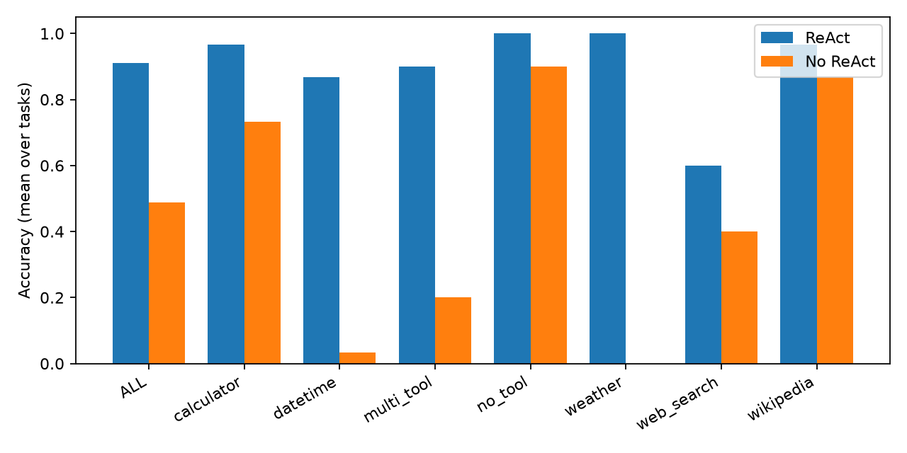

# Benchmark report

Run meta: `{   "started": "2026-10-10T15:43:15.573023",   "git": "1a7f4ac",   "k": 1,   "seed": 0,   "n_tasks": 180,   "settings": {     "model": "gemma4:e4b",     "temperature": 0.0,     "max_steps": 10,     "top_p": 0.9,     "stop": [       "PAUSE",       "Observation:"     ],     "max_output_tokens": 2048,     "tool_timeout": 15,     "request_timeout": 120.0,     "reasoning_effort": "none"   },   "mock": false }`

## Accuracy: ReAct vs no-ReAct (paired by task)

| group | n_tasks | acc_react | acc_no_react | diff | ci_lo | ci_hi | react_only_wins | no_react_only_wins | p_mcnemar | p_holm |
|---|---|---|---|---|---|---|---|---|---|---|
| ALL | 180.000 | 0.911 | 0.489 | 0.422 | 0.344 | 0.500 | 80.000 | 4.000 | 0.000 |  |
| calculator | 30.000 | 0.967 | 0.733 | 0.233 | 0.067 | 0.400 | 8.000 | 1.000 | 0.039 | 0.156 |
| datetime | 30.000 | 0.867 | 0.033 | 0.833 | 0.700 | 0.967 | 25.000 | 0.000 | 0.000 | 0.000 |
| multi_tool | 20.000 | 0.900 | 0.200 | 0.700 | 0.450 | 0.900 | 15.000 | 1.000 | 0.001 | 0.003 |
| no_tool | 30.000 | 1.000 | 0.900 | 0.100 | 0.000 | 0.200 | 3.000 | 0.000 | 0.250 | 0.656 |
| weather | 20.000 | 1.000 | 0.000 | 1.000 | 1.000 | 1.000 | 20.000 | 0.000 | 0.000 | 0.000 |
| web_search | 20.000 | 0.600 | 0.400 | 0.200 | 0.000 | 0.450 | 5.000 | 1.000 | 0.219 | 0.656 |
| wikipedia | 30.000 | 0.967 | 0.867 | 0.100 | -0.033 | 0.233 | 4.000 | 1.000 | 0.375 | 0.656 |

`diff` = ReAct − no-ReAct accuracy, 95% bootstrap CI over tasks. p_mcnemar: exact McNemar on majority-vote outcomes. p_holm: Holm-corrected across categories (ALL excluded).

## Run-level model

GEE logistic (clustered by task): OR = 10.72, p = 0.0000

## Secondary metrics (paired Wilcoxon over tasks)

| metric | react | no_react | p |
|---|---|---|---|
| latency | 11.691 | 0.996 | 0.0000 |
| steps | 2.739 | 1.000 | 0.0000 |

## Tool behaviour (ReAct only)

- No-tool tasks where ReAct called a tool anyway: 60.0% (n=30)
- Tool-requiring tasks where all expected tools were used: 96.6% (n=146)
- ReAct error/timeout rate: 0.6%; no-ReAct: 0.0%